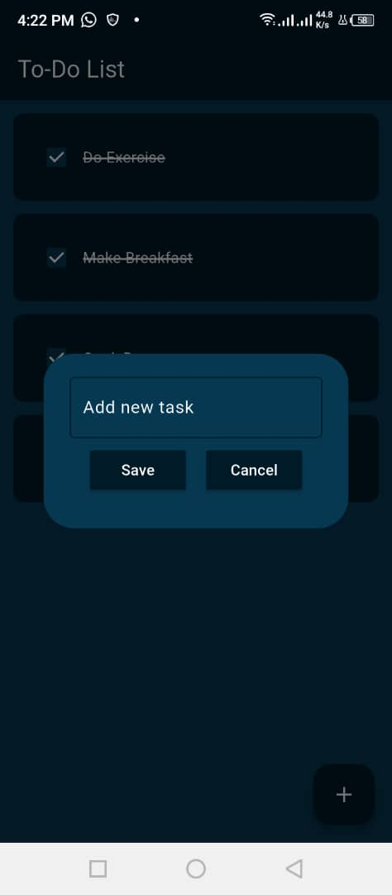
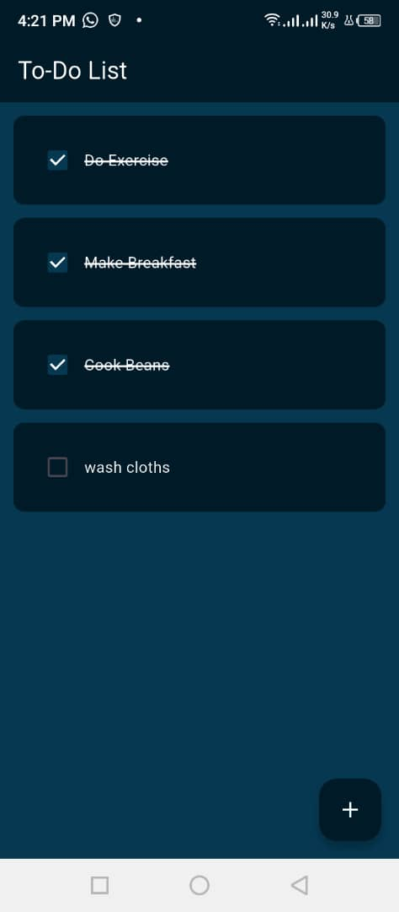

# To-Do List App

This is a simple **To-Do List mobile app** built using **Flutter**. It allows users to keep track of their daily tasks with an interactive checkbox system and a clean, minimal UI.

## Features

- Add daily tasks (feature coming soon)
- Mark tasks as completed 
- Automatically strikes through completed tasks
- Color-themed UI with styled checkboxes and text
- Fully responsive using Flutter’s `ListView.builder`

## Screenshots
## To-Do List Home Screen

## To-Do List Add New Task
